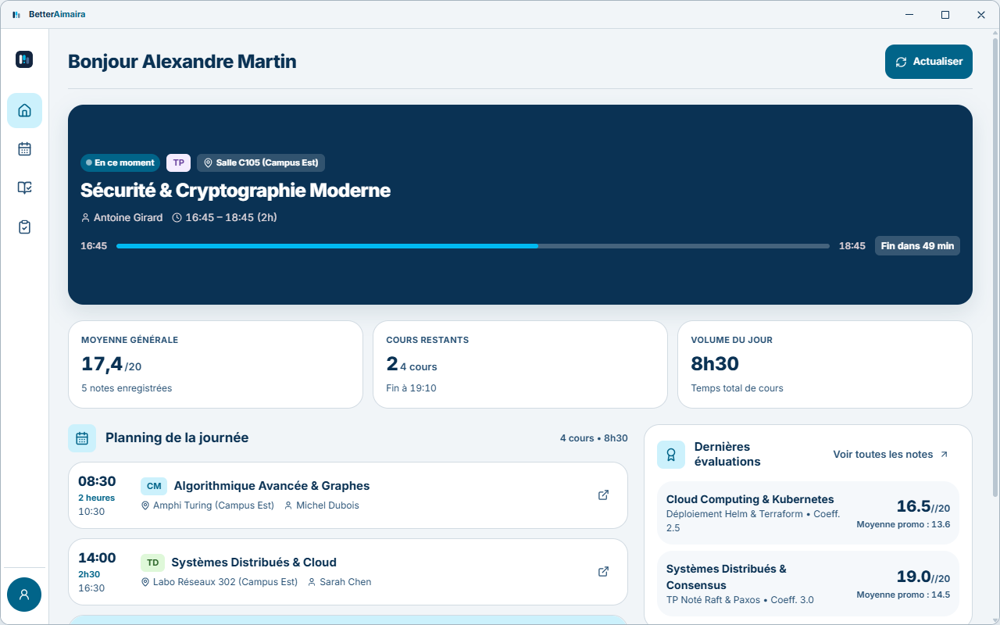
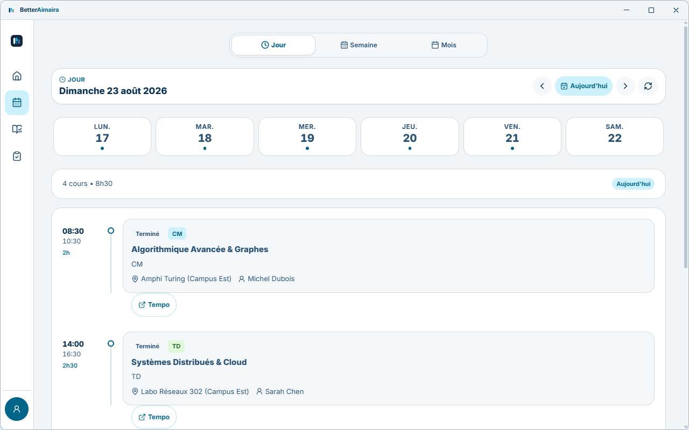
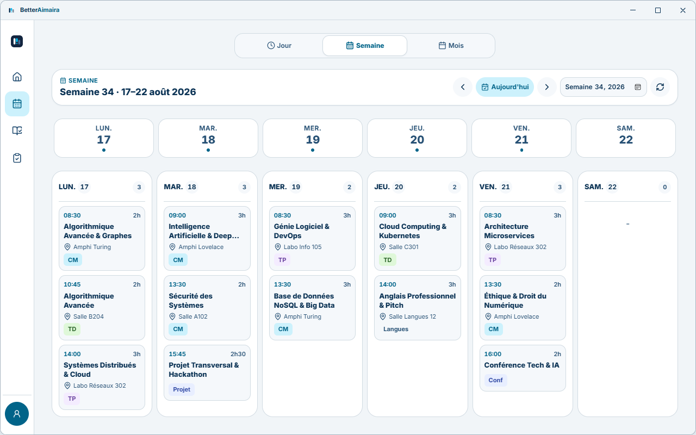
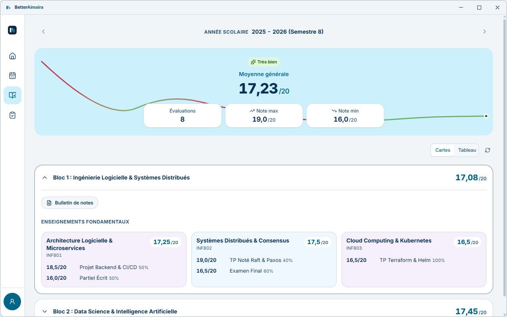

<div align="center">
  
<h1>BetterAimaira</h1>
<p><strong>Un client local qui remplace le portail étudiant Aimaira par une application adaptative Tauri.</strong>
<br>
<strong>Compatible <code>Windows</code>, <code>macOS</code>, <code>Linux</code>, <code>Android</code> et <code>iOS</code></strong></p>
<br>
<p>
<a href="https://github.com/fr-timothe/BetterAimaira/actions/workflows/release.yml"></a>
<a href="https://github.com/fr-timothe/BetterAimaira/releases"></a>
<a href="https://github.com/fr-timothe/BetterAimaira/releases"></a>
<a href="LICENSE"></a>
</p>
<br>
<p>
  <a href="README.md"><strong>🇫🇷 Français</strong></a> &bull;
  <a href="README.en.md">🇬🇧 English</a>
</p>
<br>
<p><strong>Liens rapides</strong></p>
<p>
<a href="#captures-décran"></a>
<a href="#principales-fonctionnalités"></a>
<a href="#téléchargement"></a>
<a href="docs/README.md"></a>
</p>
<p>
<a href="#développement"></a>
<a href="#confidentialité"></a>
<a href="#stack-technique"></a>
<a href="#licence"></a>
</p>

<p align="center">
  
</p>
<p align="center">
  <small>🎥 <a href="assets/showcase/betteraimaira-presentation.mp4">Télécharger la vidéo de présentation 1080p (MP4)</a></small>
</p>
</div>

## Introduction

Aimaira est un intranet web utilisé par les établissements d'enseignement pour les emplois du temps, les notes, les absences et les documents administratifs.
BetterAimaira en est un client natif : l'étudiant colle n'importe quelle page de son propre portail, le cœur en Rust la normalise vers son origine HTTPS, s'authentifie, et l'interface affiche l'essentiel en priorité — le cours actuel ou suivant, sa salle et la fraîcheur des données.

L'application communique exclusivement avec le portail configuré et rien d'autre. Aucun relais cloud intermédiaire n'est utilisé, les identifiants résident dans le trousseau sécurisé du système d'exploitation, et chaque vue indique explicitement son état (en chargement, vide, obsolète, hors ligne, expiré ou en erreur) sans jamais deviner. Cette première version est strictement en lecture seule : les actions administratives, de facturation et d'écriture distante sont hors périmètre.

## Captures d'écran

<p align="center">
  <em>(Captures d'écran issues de l'interface de l'application en anglais)</em>
</p>

<div align="center">
 <table>
  <tr>
   <td align="center"><strong>Aujourd'hui — Cours en direct & Métriques</strong></td>
   <td align="center"><strong>Emploi du temps — Vue Jour</strong></td>
  </tr>
  <tr>
   <td></td>
   <td></td>
  </tr>
  <tr>
   <td align="center"><strong>Emploi du temps — Grille Semaine</strong></td>
   <td align="center"><strong>Notes & Évaluations</strong></td>
  </tr>
  <tr>
   <td></td>
   <td></td>
  </tr>
 </table>
</div>

## Principales fonctionnalités

<details>
  <summary>Session et portail</summary>

- `Sélecteur d'école` avant le formulaire (129 établissements clients d'Aimaira, recherche par nom, sigle ou groupe, l'adresse du portail est remplie à la sélection ; le formulaire de connexion ne demande plus que l'e-mail et le mot de passe et rappelle simplement l'école visée, sans afficher son adresse)
- `Saisie manuelle de l'adresse` dans le sélecteur, en modale (école absente de la liste, ou établissement dont l'adresse n'est pas connue) : l'adresse y est normalisée avant d'ouvrir le formulaire
- `Normalisation de l'URL du portail` (tout lien profond collé est réduit à son origine HTTPS)
- `HTTPS uniquement` (un portail en HTTP est rejeté avant tout envoi d'identifiants)
- `Authentification par formulaire en Rust` (jeton anti-falsification, gestionnaire privé de cookies)
- `Persistance optionnelle du mot de passe` (Windows Credential Manager, Trousseau macOS, Keystore Android, Secret Service Linux)
- `Restauration automatique de session` au lancement
- `Écran d'introduction au premier lancement` (présentation en une page, puis la liste des autorisations que la plateforme réclame)
- `Codes d'erreur stables` (traduits dans l'interface, jamais de diagnostics bruts)
- `Interface en français et en anglais`, complète dès la première version
</details>

<details>
  <summary>Emploi du temps et planning</summary>

- `Semaine ancrée le lundi` (correspondant à la fenêtre de requête de 7 jours du portail)
- `Cours actuel ou suivant` avec salle, enseignant et note du portail
- `Compte à rebours et progression` pour le cours en cours
- `Sélecteur de jour` sur fenêtres compactes, `Grille hebdomadaire` dès que la largeur le permet
- `Paramètres de planning du portail` (`urlTempoSeance`, `tempoLinkVisible`, `sundaysVisible`)
- `Lien de séance Tempo`, uniquement lorsque le portail le signale comme visible
- `Nettoyage du texte du portail` (le HTML du portail est converti en texte brut avant de quitter Rust)
</details>

<details>
  <summary>Notes, présences et documents</summary>

- `Notes` (lecture seule `/Note`, adaptateur sémantique en Rust)
- `Synchronisation des notes au lancement` (l'année scolaire en cours est enregistrée en SQLite et rejouée hors ligne)
- `Présences et absences` (lecture seule `/Absence`)
- `Profil` (lecture seule `/Profil`)
- `Documents` (lecture seule `/Document`)
- `Questionnaires` (lecture seule, avec détail des réponses)
- `Téléchargement sécurisé de PDF` (liste blanche same-origin, vérification de signature PDF, limite à 25 Mio)
</details>

<details>
  <summary>Interface</summary>

- `Mise en page adaptative` dictée par la largeur de fenêtre, et non par le nom du terminal
- `Cinq destinations` (Aujourd'hui, Planning, Notes, Présences, Plus)
- `Barre inférieure flottante` sur fenêtres compactes, `Tiroir latéral et barre supérieure` sur bureau
- `États explicites et honnêtes` (chargement, vide, erreur, expiré, hors ligne, obsolète — sans faux-semblant)
- `Indicateurs de fraîcheur` sur chaque vue en cache
- `Cible tactile interactive minimale de 44px`, focus visible, navigation complète au clavier
- `Support de Reduced Motion` et des zones de sécurité (`Safe Area`)
- `Barre de titre personnalisée sans bordure` sur bureau
</details>

<details>
  <summary>Mises à jour et distribution</summary>

- `Flux de mise à jour unifié` (un manifeste par canal, publié sur GitHub Pages et lu par toutes les plateformes)
- `Installation en place signée` sur bureau (vérification minisign, NSIS passif)
- `Passage de relais à PackageInstaller` sur Android
- `Vérification de source AltStore` sur iOS
- `Notification de mise à jour au lancement` (annoncée une fois par version, mène à la carte qui l'installe)
- `Version installée visible` dans l'onglet Profil de la vue Plus
</details>

<details>
  <summary>Prévu — pas encore implémenté</summary>

- `Mode sombre` (les tokens existent, la version actuelle est livrée en mode clair)
- `Analyses des notes` (courbes de tendances, distribution de classe, simulateur de moyenne)
- `Analyses des présences` (jauge de quota et indicateurs ECTS)
- `Annuaire du campus` (listes du corps enseignant et des étudiants)
- `Export iCal` (génération `.ics` et serveur local d'abonnement)
- `Widgets et barre système` (écran d'accueil Android/iOS, zone de notification Windows, barre de menus macOS)
- `Déverrouillage biométrique` (Face ID, Touch ID, Windows Hello)
</details>

Le groupe des fonctionnalités prévues est détaillé dans [docs/INTEGRATIONS.md](docs/INTEGRATIONS.md).

## Téléchargement

| Plateforme | Fichier | Installation |
|---|---|---|
| Windows | `BetterAimaira-v<version>-x86_64.exe` | Installeur NSIS, se met à jour en place |
| macOS, Linux | `.dmg`, `.app`, `.AppImage`, `.deb` | Compilé localement pour l'instant, même système de mise à jour |
| Android | `BetterAimaira-v<version>-universal.apk` | `arm64-v8a`, `armeabi-v7a` et `x86_64`, puis invite d'installation du système |
| iOS | `BetterAimaira-v<version>-arm64.ipa` | Source AltStore/SideStore, publié manuellement |

Un seul schéma de nommage, `BetterAimaira-v<version>-<architecture>.<extension>` : la plateforme est portée par l'extension.

<a href="https://betteraimaira.montfrond.work/download"></a>

Chaque plateforme lit le même flux de publication, et une version installée vérifie les mises à jour trois secondes après son lancement.

La page [betteraimaira.montfrond.work/download](https://betteraimaira.montfrond.work/download) détecte l'appareil, résout la dernière version publiée et donne les étapes d'installation plateforme par plateforme.

La page [betteraimaira.montfrond.work/ecoles](https://betteraimaira.montfrond.work/ecoles) liste les établissements sous Aimaira, l'adresse de leur portail et ce que l'application sait en faire. Un établissement absent de cette liste n'est probablement pas compatible.

## Documentation

| Document | Sujet |
|---|---|
| [Architecture](docs/ARCHITECTURE.md) | Backend Rust, IPC Tauri, stratégie de cache, frontières de sécurité |
| [Structure de l'application et plateformes](docs/APP_STRUCTURE_AND_PLATFORMS.md) | Règles de mise en page adaptative, spécificités par plateforme, matrice de release |
| [API Backend](docs/BACKEND_API.md) | Commandes Tauri, contrats sérialisés, téléchargement de documents, codes d'erreur |
| [Système de design](docs/DESIGN_SYSTEM.md) | Tokens, points de rupture (breakpoints), mises en page responsives |
| [Directives de design](DESIGN.md) | Application des tokens, primitives partagées, états honnêtes |
| [Intégrations](docs/INTEGRATIONS.md) | Flux iCal, widgets bureau et mobile |
| [Performance](docs/PERFORMANCE.md) | Commandes de référence, outils de profilage, budgets de bundle |
| [Produit](PRODUCT.md) | Utilisateurs, périmètre, contraintes, principes produit |
| [Ressources de marque](assets/README.md) | Fichiers de logo, géométrie, palette, composant Svelte |
| [Annuaire des écoles](assets/schools/README.md) | Liste des établissements sous Aimaira, adresses de portail, logos, procédure de mise à jour |
| [Site vitrine](site/README.md) | Projet Astro de `site/`, contenu bilingue, déploiement sur `gh-pages` |

## Site vitrine

Le site public vit dans [`site/`](site/README.md) : une page d'accueil, une page de téléchargement et une page de compatibilité, en français et en anglais, servies à la racine de **[betteraimaira.montfrond.work](https://betteraimaira.montfrond.work)**. C'est un projet Astro autonome, avec ses propres dépendances.

Il sert aussi les logos que l'application affiche dans son sélecteur d'école, sous `/media/schools/`. C'est la raison pour laquelle l'application ne les embarque pas : la liste peut grandir sans qu'une nouvelle version soit publiée.

```bash
cd site
bun install
bun run dev      # http://localhost:4321
bun run build    # génère site/dist/
bun run check    # astro check
```

Le workflow [`pages.yml`](.github/workflows/pages.yml) le publie à chaque push sur `master` touchant `site/` ou les assets de vitrine, en **commitant dans la branche `gh-pages`**. Cette branche porte aussi le flux de mise à jour que les applications installées interrogent : le workflow préserve `CNAME`, `.nojekyll` et `updates/`, et la source Pages ne doit pas être basculée sur GitHub Actions.

## Développement

### Prérequis

- [Bun](https://bun.sh/) >= 1.2
- [Rust et Cargo](https://rustup.rs/) >= 1.80
- [Prérequis de plateforme Tauri](https://v2.tauri.app/start/prerequisites/) pour les cibles à compiler

### Commandes

```bash
# Cloner et installer
git clone https://github.com/fr-timothe/BetterAimaira.git
cd BetterAimaira
bun install

# Desktop (1280x800, barre de titre personnalisée sans bordure)
bun run desktop:dev

# Aperçu mobile sur desktop (résolution 412x892, mode mobile forcé)
bun run mobile:dev

# Mobile natif, sur émulateur ou appareil physique
bun run android:dev
bun run ios:dev
```

```bash
# Compilation release
bun run desktop:build

# Compilation release exportée vers dist-desktop/, purge de target/
bun run desktop:build:export

# Nettoyage des artefacts de build (src-tauri/target, .svelte-kit, build)
bun run clean

# Cache intermédiaire du compilateur uniquement, bundles release conservés
bun run clean:cache
```

Pousser un tag `v*` déclenche le workflow [`.github/workflows/release.yml`](.github/workflows/release.yml), qui compile l'installeur Windows ainsi que l'APK Android, génère les manifestes de mise à jour, publie la release et commite les manifestes sur la branche `gh-pages`.

Seul le tag déclenche ce workflow : bumper la version et pousser le commit ne publie rien. Le tag se pose avec le script dédié, qui refuse un arbre sale, un `HEAD` non poussé ou une version déjà taguée :

```bash
# Vérifie sans rien pousser
bun run release:tag -- --dry-run

# Tague le commit courant en v<version de package.json> et pousse le tag
bun run release:tag
```

La description de la release est construite à partir des commits ajoutés depuis le tag précédent, groupés par type de commit conventionnel. Le rendu se relit en local avant de taguer :

```bash
bun run release:notes
bun run release:notes -- --tag v0.2.0 --previous v0.1.9
```

Android ne compare pas les noms de version mais les `versionCode` : un APK dont le code n'est pas supérieur à celui installé n'est pas une mise à jour pour le système. Le code est dérivé de la version du paquet, jamais choisi à la main :

```bash
# Écrit bundle.android.versionCode dans src-tauri/tauri.conf.json
bun run android:version-code

# Échoue si le fichier n'est pas à jour, sans rien écrire
bun run android:version-code -- --check
```

La formule est `major * 1 000 000 + minor * 10 000 + patch * 100 + préversion`, la préversion valant son numéro de suffixe (`beta.5` → 5) et `99` pour une version finale : `0.1.1-beta.5` donne `10105`, `0.1.1` donne `10199`. Le workflow de release relance la dérivation avant de compiler, donc un bump de version qui l'aurait oubliée publie quand même une vraie mise à jour.

L'application lit son flux de mise à jour sur <https://betteraimaira.montfrond.work>, servi par GitHub Pages depuis la branche `gh-pages`, un dossier par canal :

| Canal | Manifeste |
|---|---|
| Stable | <https://betteraimaira.montfrond.work/updates/stable/latest.json> |
| Bêta | <https://betteraimaira.montfrond.work/updates/beta/latest.json> |

Un build dont la version porte un suffixe de préversion suit le canal bêta par défaut ; le canal est modifiable dans Réglages. Au lancement, une vérification silencieuse (une par tranche de 6 h, relancée à chaque démarrage tant qu'une mise à jour attend) fait apparaître une notification — bandeau en haut de l'écran sur téléphone, carte en bas à droite sur bureau : la toucher ouvre la carte Mises à jour de la vue Plus, la fermer met cette version en sourdine, la laisser expirer la représente au lancement suivant. Le domaine personnalisé vit dans le fichier `CNAME` à la racine de `gh-pages` : le supprimer coupe le flux de mise à jour de toutes les versions installées.

### Vérification

```bash
bun run check
bun run build
cd src-tauri
cargo test
cargo clippy --all-targets -- -D warnings
```

`bun run dev` affiche l'interface dans un navigateur mais sans le backend Rust : l'authentification au portail et le trousseau de clés n'y sont donc pas disponibles. Utilisez `bun run desktop:dev` ou `bun run mobile:dev` pour exécuter le backend complet.

### Pont d'automatisation pour le développement

`bun run desktop:dev` démarre un pont local d'automatisation (`tauri-plugin-mcp-bridge`) sur `127.0.0.1:9223` afin de piloter et vérifier l'application face au portail durant le développement. Il est exclu des builds de release via la fonctionnalité Cargo `dev-automation` et un garde `#[cfg(debug_assertions)]` dans `src-tauri/src/lib.rs`. Ses permissions sont déclarées dans `src-tauri/capabilities/dev/dev-mcp-bridge.json`.

N'activez pas ce pont dans les versions distribuées.

## Confidentialité

- **Aucun relais cloud.** Les données scolaires transitent directement de l'appareil vers le portail configuré par l'étudiant, nulle part ailleurs.
- **Mesure d'usage sur accord explicite, sans identifiant.** L'onboarding demande une fois si l'application peut compter ses usages ; le refus est le comportement par défaut et n'envoie rien, pas même le refus. Le `distinct_id` est un UUID tiré au lancement et jamais persisté, donc deux exécutions ne peuvent pas être corrélées. La liste exhaustive des événements et du contenu envoyé est dans `src-tauri/src/analytics.rs`, clé de projet incluse : c'est une clé d'écriture publique par nature, elle voyage dans chaque client qui rapporte et le projet qu'elle vise ne contient aucune donnée scolaire.
- **Ni service push, ni analytique tierce dans la webview.** La synchronisation des notes ne tourne que lorsque l'application est active, et la capture d'usage part du cœur Rust, jamais d'un script chargé à côté des données de l'élève.
- **Les cookies restent dans Rust.** Le gestionnaire de cookies de session réside en mémoire et ne franchit jamais la frontière IPC.
- **Mots de passe stockés dans le coffre-fort de l'OS.** Aucun mot de passe en clair dans SQLite ou les préférences frontend. La déconnexion explicite supprime l'entrée enregistrée.
- **HTTPS obligatoire.** Tout portail en HTTP est immédiatement rejeté avant la transmission des identifiants.
- **Cache local uniquement.** SQLite conserve les copies hors ligne des notes, de l'emploi du temps et des pages du portail.
- **Strictement en lecture seule.** Le client n'écrit jamais sur le portail distant.
- **Données du portail non fiables.** Le contenu distant est rendu sous forme de texte brut sécurisé.

## Stack technique

| Couche | Technologies |
|---|---|
| **Cœur et backend** | [Rust](https://www.rust-lang.org/), [Tauri 2.0](https://v2.tauri.app/), `reqwest` (cookie jar), `scraper` (parsing HTML), `rusqlite` (cache), `keyring` (coffre-fort OS) |
| **Frontend** | [Svelte 5](https://svelte.dev/) (runes), [TypeScript](https://www.typescriptlang.org/), [Tailwind CSS v4](https://tailwindcss.com/), adaptateur statique [SvelteKit](https://svelte.dev/docs/kit) |
| **Thème et tokens** | [FL-Theme via tweakcn](https://tweakcn.com/r/themes/cmq57ht7w000204l2axo6ho9v), republié en utilitaires Tailwind via le bloc `@theme inline` dans `src/app.css` — voir [DESIGN.md](DESIGN.md) |
| **Typographie** | [Inter](https://rsms.me/inter/) variable, auto-hébergée avec `@fontsource-variable/inter` (un client Tauri ne dépend pas d'un CDN externe) |
| **Icônes et graphiques** | [Lucide Svelte](https://lucide.dev/), SVG Svelte 5 sur mesure |
| **Internationalisation** | [Paraglide JS](https://inlang.com/m/gerre34r/library-inlang-paraglideJs) (Français, Anglais) |
| **Gestionnaire de paquets** | [Bun](https://bun.sh/) |

## Contribution

Les contributions sont les bienvenues. [CONTRIBUTING.md](CONTRIBUTING.md) détaille les limites non négociables du projet, ce qu'une pull request doit vérifier et les conventions de commit. En résumé :

- Consultez [DESIGN.md](DESIGN.md) : utilitaires au niveau de l'élément, tokens issus de `src/app.css`, aucune déclaration locale de couleur ou de rayon d'arrondi.
- Placez chaque texte visible par l'utilisateur dans le catalogue Paraglide (`messages/`).
- Respectez la contrainte de lecture seule : aucune nouvelle route d'écriture vers le portail.
- Exécutez le bloc de vérification ci-dessus : `bun run check` et `cargo clippy -- -D warnings` doivent s'exécuter sans erreur ni avertissement.
- Messages de commit rédigés en anglais, à l'impératif, avec une ligne de résumé courte.

Pour signaler un bug ou poser une question plutôt que contribuer : [SUPPORT.md](SUPPORT.md).

## Licence

[GPL-3.0](LICENSE). Aimaira est un produit tiers ; ce projet est un client indépendant et n'est aucunement affilié à son éditeur.

Les marques citées, ainsi que les noms et logos d'écoles repris dans `assets/schools/`, appartiennent à leurs titulaires et ne sont pas couverts par la GPL-3.0 : voir [NOTICE.md](NOTICE.md).
