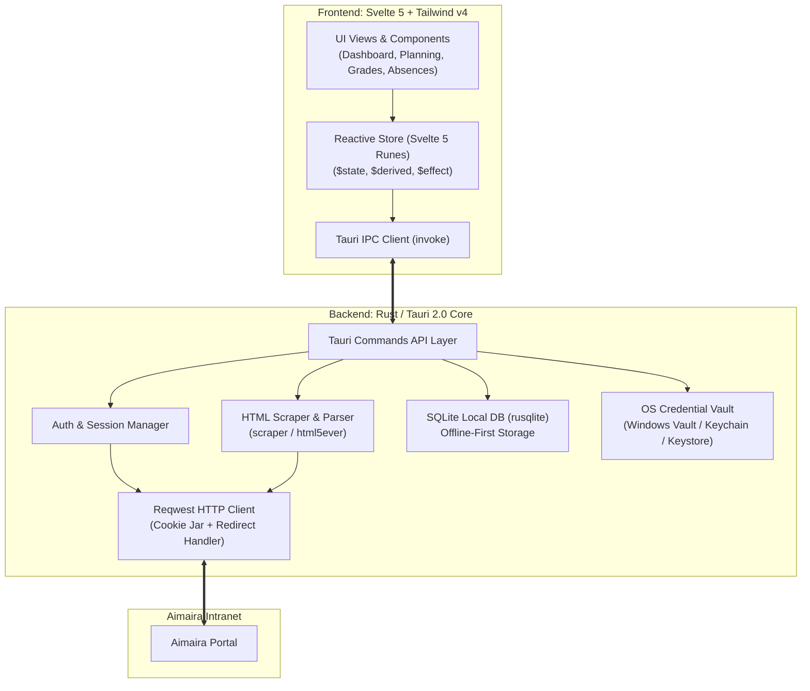

[← Documentation index](README.md)

# Architecture and technical specifications

This document describes the internal architecture of BetterAimaira, detailing communication between the Rust backend (Tauri 2.0) and the Svelte 5 frontend, data persistence, and security.

---

## 1. System architecture



---

## 2. Rust backend architecture

### Directory structure

```
src-tauri/src/
├── main.rs                 # Tauri application entry point
├── lib.rs                  # Plugin registration and command bindings
├── commands.rs             # Typed Tauri IPC adapters
├── state.rs                # In-memory authenticated session
├── error.rs                # Stable serialized command errors
├── credentials.rs          # Native credential-store adapter
├── storage.rs              # The single owner of the SQLite file and its migrations
├── grade_sync.rs           # On-disk copy of the grades the portal last returned
├── portal_store.rs         # On-disk snapshots of the last portal answers
├── updater.rs              # Update feed, per-platform install delivery
├── permissions.rs          # Rights the reader grants by hand (Android only)
├── android_bridge.rs       # JNI entry into the app's own Kotlin classes
├── aimaira.rs              # Authentication and calendar adapter
└── aimaira/
    └── portal/             # Semantic HTML resources and safe PDF downloads
        ├── mod.rs          # PortalResource, the two loaders, page assembly
        ├── model.rs        # Every serialized type the frontend reads
        ├── grades.rs       # Year → block → course accordions
        ├── absences.rs     # Year → block → missed sessions
        ├── questionnaires.rs # List entries and read-only response detail
        ├── tables.rs       # Generic tables, definition lists, form controls
        ├── documents.rs    # Document discovery and streaming PDF download
        ├── html.rs         # Text extraction and same-origin URL helpers
        └── selectors.rs    # One LazyLock<Selector> per CSS selector
```

`selectors.rs` exists for a measurable reason rather than tidiness. Two call
sites used to rebuild their selectors on every element — four per course tile,
four per table — which on a three-year grades page meant several hundred CSS
compilations per load. Declaring each selector once also removed the forty
`Selector::parse(..).unwrap()` calls that came with the old shape.

`android_bridge.rs` exists because a JNI call by class name resolves against the
class loader of the Java frame below it. Tauri commands run on threads the
runtime attached from native code, which have no such frame and fall back to the
system class loader — the app's own classes are invisible from there. Every
native call into Kotlin therefore goes through the context's own class loader.

---

## 3. Frontend architecture (Svelte 5)

### Where state lives

There is no single application store. State sits at the narrowest scope that can
hold it, which falls into three tiers.

**Application-wide singletons — `src/lib/state/`.** One concern each, one exported
instance, all on the same shape: a class with `$state` fields.

| Module | Owns |
|---|---|
| `connectivity.svelte.ts` | Whether the device has a network path. A false value is authoritative; a true one only means the attempt is worth making. |
| `session-recovery.svelte.ts` | Replaying the saved password when the portal drops the session, single-flight, with the loop budget. |
| `announcements.svelte.ts` | The message shown in the one polite live region the layout renders. |
| `locale.svelte.ts` | The interface language, as a signal. |

`locale.svelte.ts` is worth explaining, because a reader will wonder why the
language needs a rune when Paraglide already has one. Paraglide resolves every
`m.*()` against a plain module variable, so a message read directly in markup
compiles to an effect with no reactive dependency and never re-runs on a language
change. The interface used to work around this with a bare `locale;` statement
inside each `$derived.by` — load-bearing, but a dependency list nothing in the
toolchain checks, and one entry of it was already wrong. The shell and the title
bar are now keyed on this rune instead, so a language change remounts them and
the whole class of defect goes with it. The pre-authentication screens are
deliberately outside those keys and keep the touch statement: remounting there
would discard a portal address, username and password the reader had typed.

**Feature state — a `.svelte.ts` module beside the feature.** `updates`,
`onboarding`, and for the schedule `portal-resource` (the shared load/refresh
shell behind Grades, Absences and Questionnaires), `calendar-navigation`,
`calendar-format` and `academic-view`. These are factories or small classes, not
singletons, so each mounted view owns its own instance.

**View state — `$state` in the component.** Everything a single screen needs and
nothing else reads.

The rule that keeps this from drifting back into one store: a value moves up a
tier only when a second consumer genuinely needs it. `session-recovery` exposes a
`recoveries` counter with exactly one consumer for that reason — it is not a
"the session changed" broadcast, and turning it into one would be a shell remount
under another name.

---

## 4. Offline-first and caching strategy

### Where a read comes from

Every portal read passes three tiers, tried in order:

1. **Memory.** A copy held for five minutes and dropped with the process. `state.rs` keeps it for portal resources; the schedule's equivalent lives in the client, keyed by requested range. A `force` refresh skips both.
2. **The portal.** A successful fetch fills the memory cache and is written to SQLite as the snapshot for that account, under the resource or the requested range.
3. **The snapshot on disk.** Reached only once the portal read has failed. The stored payload is returned with `stale` raised and the `fetchedAt` of the fetch it came from, never the moment it was read back, which is what lets the interface state the real age of what is on screen instead of presenting it as current.

A stale answer is never memoised, in Rust or in the client. Caching it would keep
serving it after the network came back; leaving it out means the next read reaches
the portal again.

Snapshots are filed under an account key hashed from the portal address and the
username. The key is taken from the live session when there is one and from the
saved keyring identity otherwise; that fallback is the point of the whole
mechanism, because a cold start with no network has no session and is exactly when
the stored rows have to be found.

`sync_grades` keeps its own copy on the same terms. A read that reached the portal
replaces the grades stored for the account; a grades page that came back from disk
is handed to the caller as it stands, read and never written back, because a page
the app could not refresh is no evidence of what the portal holds now.

### The one failure never answered from disk

`session_expired` reaches the fallback from two different places. With no session
open it is the cold offline start above, and the snapshot is served. With a
session open it means the portal redirected an authenticated request to its login
page, and there the fallback is refused: replaying a snapshot would hide the
expiry behind data that can never refresh, leaving the reader on frozen content
with nothing on screen offering the sign-in that [DESIGN.md](../DESIGN.md) makes
the required action for an expired session. `may_serve_snapshot` in `commands.rs`
is that rule, with a unit test on each branch. Every other error code falls back
either way. The error reaching the client is also what the next section depends
on: a snapshot served in its place would suppress the replay before it was ever
attempted.

### Replaying the password behind a failed read

An expired session used to end at the login form, which asked the reader to
retype a password the app already had. The request path now intercepts the
expiry itself: `src/lib/state/session-recovery.svelte.ts` calls
`restore_session`, and the read that failed is issued once more against the
session it comes back with. On the happy path nothing is shown. A card appears
only once a replay has failed.

Three call sites intercept `session_expired`, and no others.
`loadPortalResource` in `portal-cache.ts` covers grades, absences, profile,
documents and questionnaires, because every one of them is read through it;
`loadSchedule` and `syncGrades` in `ScheduleApp.svelte` cover the two commands
that bypass it. Each allows itself exactly one retry — a session that dies again
on the replayed read falls through to the error state rather than round-tripping
forever.

The module is single-flight and shares its answer. The authenticated shell loads
five resources at once, so an expiry is discovered five times over; one replay
runs and every caller gets the real verdict, since each has a read of its own to
retry. On success the client's memory tier is dropped, because everything in it
was read through the session that just died. It is dropped without bumping the
cache generation, which would orphan the very in-flight read the recovery exists
to let through.

A loop guard sits in front of all of it. A session that is recovered and then
dropped again within thirty seconds is not an expiry but a portal capping
concurrent sessions, handing back a session it invalidates on the next read.
After two such refusals the module gives up and stops replaying on its own; only
a deliberate tap on the expired card may restart the budget, never an automatic
read, which is what keeps a reader changing tabs from hammering the portal with
sign-ins. Attempts that never reached the portal — no backend, or no network —
say nothing about the saved password and do not spend the budget either.

Nothing is remounted on this path. Recovery keeps the active tab, the scroll
position and the open accordions, which is the difference between it and the
offline-to-online upgrade below. The one thing that must be re-read is the
planning settings: `restore_session` builds a fresh session whose planning is
back at its defaults, so `sundaysVisible` would silently revert on every replay.
A counter of successful recoveries drives that single re-read and nothing else.

### Local database

`grades.sqlite` under the application data directory is owned by `storage.rs`: one
place that opens connections, runs migrations keyed on `PRAGMA user_version`, and
sets a five-second `busy_timeout` so short overlapping writes from blocking tasks
queue instead of failing outright. Version 1 holds three tables —
`grade_snapshots` keyed by account and grade, `portal_snapshots` keyed by account
and resource, `schedule_snapshots` keyed by account and requested range — and
drops two more, `grade_sync_accounts` and `grade_alerts`, left behind by the
in-app new-grade alert the product withdrew because iOS cannot be made to fire it
reliably; [APP_STRUCTURE_AND_PLATFORMS.md](APP_STRUCTURE_AND_PLATFORMS.md) carries
the background-execution limits that decided it. A database written before the
withdrawal is therefore cleaned up the first time it is opened. A schema change
means appending one entry to the migration list and nothing else; the batch
creates what it needs only if absent, because installs that predate the counter
sit at version 0 with the grade tables already there.

### Startup with no network

`saved_identity` reports `hasSnapshots` alongside the saved account, so the
startup screen knows before touching the network whether there is anything to
show. Offline with something stored, the app opens the authenticated shell on that
content rather than holding the reader on the restore screen; signing in remains
impossible, so the shell runs in an offline mode where every surface labels how
old what it shows is. When connectivity returns, the recovery module runs
`restore_session` — the same single-flight replay, so a connectivity effect that
fires twice is already handled — and the shell remounts once against the live
session, rather than being patched in place behind views still holding snapshot
data. This is the one re-authentication that does remount: every view here is
showing snapshot data that only a live session can replace, whereas a recovered
session mid-use is replacing one read.

### What this is not

Snapshots cover reads only. BetterAimaira writes nothing to the portal, so there
is no queue of pending changes to replay, and a range or a resource that was never
fetched has nothing to fall back to.

---

## 5. Security and privacy

- **Zero cloud relay.** Credentials and student data are transmitted directly between the user device and the configured Aimaira portal. The opt-in usage counter below is the only other network destination, and it carries none of that data.
- **Encrypted storage.** User passwords are not stored in plaintext; they are saved in the operating system credential vault (`keyring` crate).
- **Unencrypted snapshots.** The offline copies of portal pages, schedules and grades sit in plain SQLite under the application data directory, guarded by the operating system's file permissions and nothing else. `logout` clears the saved credentials and the session; it does not delete those rows. No password and no cookie is ever written there.
- **CSRF and session integrity.** Anti-forgery tokens and session cookies are managed with an in-memory `reqwest::cookie::Jar` during runtime.

### Implemented usage-counting boundary

- `analytics.rs` owns every capture. The interface can name an event from a fixed allowlist and attach one short lowercase token; it can never hand the module a string read from the portal, which is what keeps a grade or a portal address out of the payload by construction rather than by review.
- The `distinct_id` is a UUID minted at process start and never written to disk, and it doubles as `$session_id`. Two runs of the app cannot be correlated by anyone, so retention, returning-user counts and cross-run funnels are impossible here — deliberately. Growth is read from launch counts and release download counts instead.
- `$process_person_profile: false` on every event, so no person profile accumulates server-side.
- Consent lives in `analytics.json` under the app data directory and is checked on every capture. A missing or malformed file reads as "never asked", never as agreement.
- Accepting is reported; declining reports nothing at all, since sending "this reader declined" would be the act being declined. Opt-in rate is therefore estimated against release download counts, not measured.
- The project key is a constant in `analytics.rs`. A PostHog project key is a public credential by design — it ships inside every client that reports, so hiding it would buy nothing — and it grants writes only, to a project that holds no student data. The consequence to know: a fork that builds and distributes this app reports into the same project.
- Captures are fire-and-forget with a 5 s timeout and no retry queue: a counter that cannot be reached is never surfaced to the reader, and their activity is never queued on disk waiting for a network.
- Events go to the PostHog EU region from the Rust core, not from a script in the webview holding student data.

### Implemented authentication boundary

- `normalize_portal_url` accepts user-pasted portal addresses, adds `https://` when absent, strips path, query, and fragment parts, and rejects embedded credentials or non-HTTPS schemes.
- `login` requests `/login`, extracts `__RequestVerificationToken`, posts to `/User/LoginPost`, and detects login failures.
- `saved_identity` reports whether an account is saved, and whether anything is stored for it, without reading its password or the network, so startup shows a restore screen instead of flashing the login form and can open on stored content when the device is offline.
- `restore_session` reads the saved username and password from the native credential store and repeats the authentication flow, on startup and again whenever a read fails with `session_expired`. A password the portal refuses is reported as `credentials_rejected` so the client can explain the return to the login form.
- Two ways to forget, and they are not interchangeable. `clear_saved_password` removes the password alone and is what a rejection uses; `clear_saved_credentials` removes the password and the identity and is the deliberate sign-out behind `logout`. The identity is what names the rows already on disk when no session is open, so discarding it over a wrong password would orphan every snapshot and leave an offline cold start with nothing to show. The visible consequence is that a rejection does not outlive the run that saw it: the next start finds an identity and no password, answers `no_credentials`, and opens a pre-filled form with no error banner.
- Tauri manages the authenticated `reqwest::Client`; cookies never cross IPC.
- Password persistence targets Windows Credential Manager, Apple Keychain, Android Keystore, or Linux Secret Service depending on platform. Explicit logout clears both saved entries.
- Frontend receives stable error codes for translation, never raw network or storage diagnostic strings.

### Implemented planning boundary

- `get_schedule` accepts an ISO start instant and a duration from 1 to 42 days.
- Rust posts to `/Calendar/LoadEvents` with the authenticated cookie jar and `X-Requested-With: XMLHttpRequest`.
- The response is parsed as JSON despite Aimaira returning a `text/html` content type. Events with missing or inverted dates are discarded.
- `Planification`, `Description`, and `CommentaireExterne` are converted from portal HTML to plain text before serialization.
- Session expiry, network failures, and unexpected portal responses return distinct error codes.
- When `LoadEvents` returns `200` with an empty body for an empty schedule range, it is handled as an empty schedule rather than a parse error.
- The frontend requests Monday-anchored 7-day windows matching the portal request pattern.
- `get_planning_settings` loads `/Calendar` to capture portal planning settings (`urlTempoSeance`, `tempoLinkVisible`, `sundaysVisible`) and refreshes the copy held on the session. If parsing fails, defaults are used. Neither `login` nor `restore_session` reads them, so a session starts at the defaults and the client asks for them once it is open — including after a replayed session, which would otherwise silently lose them.
- Tempo session links are constructed as `urlTempoSeance + Id` only when the portal reports `tempoLinkVisible`.
- Local SQLite holds the grades, the portal pages and the schedule ranges read back when the portal cannot be reached. It stores no password and no session cookie.

### Implemented read-only resource boundary

- `get_portal_resource` supports grades (`/Note`), absences (`/Absence`), profile (`/Profil`), and documents (`/Document`) using the authenticated Rust cookie jar.
- Rust converts headings, contextual tables, labeled fields, and known document links to plain serialized data.
- Every resource result carries its fetch time as Unix epoch milliseconds, and `stale` when it was replayed from the local snapshot rather than fetched. A stale result keeps the timestamp of the fetch it came from, so the age shown is the age of the content.
- Source date, score, percentage, and duration values remain strings until verified normalizers are in place.
- `markupRecognized` distinguishes unsupported portal markup structures from recognized content.
- `download_portal_document` accepts only paths returned by the resource parser, enforcing HTTPS same-origin access, an allowlist of read-only routes, PDF signature validation, and a 25 MiB limit.
- Administrative, billing, and remote write routes remain excluded.
- Command and payload contracts are documented in [Rust Backend API](BACKEND_API.md).

### Development flavors and automation boundary

- `bun run desktop:dev`: Runs the desktop application with default `src-tauri/tauri.conf.json` (`1280x800` frameless custom titlebar).
- `bun run mobile:dev`: Merges `src-tauri/tauri.mobile-dev.conf.json` (`412x892` smartphone viewport, frameless mobile viewport without OS decorations, forced `mobile-app` mode via `?mobile`).
- Both dev modes enable the `dev-automation` Cargo feature, registering `tauri-plugin-mcp-bridge` behind `#[cfg(debug_assertions)]` on `127.0.0.1:9223` for automated driving and comparison against the portal. Release builds omit this feature, excluding the plugin and capability from distributed binaries.

### Translation boundary

Paraglide JS compiles `messages/fr.json` and `messages/en.json` into typed message functions. Locale resolution checks stored preference, then system language, falling back to French. Generated files under `src/lib/paraglide` are build artifacts and should not be edited manually.
