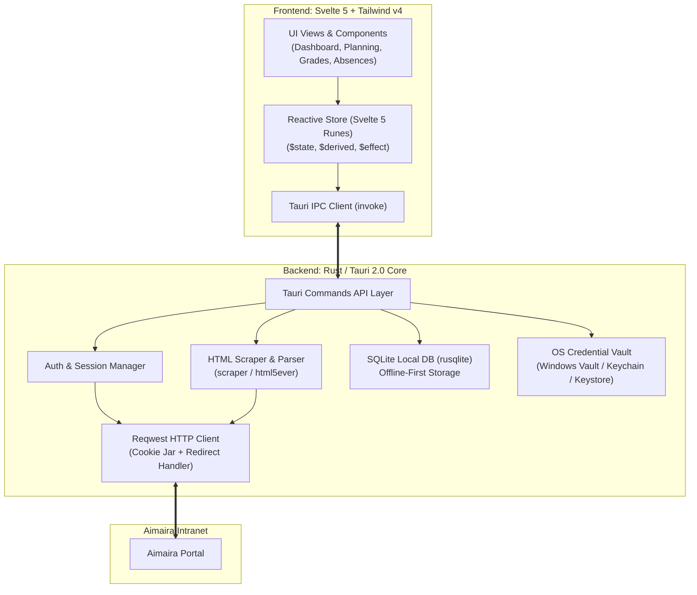

[← Documentation index](README.md)

# Architecture and technical specifications

This document describes the internal architecture of BetterAimaira, detailing communication between the Rust backend (Tauri 2.0) and the Svelte 5 frontend, data persistence, and security.

---

## 1. System architecture



---

## 2. Rust backend architecture

### Directory structure

```
src-tauri/src/
├── main.rs                 # Tauri application entry point
├── lib.rs                  # Plugin registration and command bindings
├── commands.rs             # Typed Tauri IPC adapters
├── state.rs                # In-memory authenticated session
├── error.rs                # Stable serialized command errors
├── credentials.rs          # Native credential-store adapter
├── grade_sync.rs           # Local grade history and new-grade alerts
├── updater.rs              # Update feed, per-platform install delivery
├── permissions.rs          # Rights the reader grants by hand (Android only)
├── android_bridge.rs       # JNI entry into the app's own Kotlin classes
├── aimaira.rs              # Authentication and calendar adapter
└── aimaira/
    └── portal.rs           # Semantic HTML resources and safe PDF downloads
```

`android_bridge.rs` exists because a JNI call by class name resolves against the
class loader of the Java frame below it. Tauri commands run on threads the
runtime attached from native code, which have no such frame and fall back to the
system class loader — the app's own classes are invisible from there. Every
native call into Kotlin therefore goes through the context's own class loader.

---

## 3. Frontend architecture (Svelte 5)

### Svelte 5 runes state

State management is centralized in `$lib/state.svelte.ts` using Svelte 5 runes:

```typescript
import { invoke } from '@tauri-apps/api/core';
import type { Course, GradeModule, AbsenceSummary, UserSession } from './types';

class AppStore {
  session = $state<UserSession | null>(null);
  courses = $state<Course[]>([]);
  grades = $state<GradeModule[]>([]);
  absences = $state<AbsenceSummary | null>(null);
  isLoading = $state<boolean>(false);
  isOffline = $state<boolean>(false);
  error = $state<string | null>(null);

  // Derived: Current ongoing course
  currentCourse = $derived.by(() => {
    const now = new Date().getTime();
    return this.courses.find(c => {
      const start = new Date(c.startTime).getTime();
      const end = new Date(c.endTime).getTime();
      return now >= start && now <= end;
    }) ?? null;
  });

  // Derived: Next upcoming course
  nextCourse = $derived.by(() => {
    const now = new Date().getTime();
    return this.courses
      .filter(c => new Date(c.startTime).getTime() > now)
      .sort((a, b) => new Date(a.startTime).getTime() - new Date(b.startTime).getTime())[0] ?? null;
  });

  // Derived: Overall GPA / Weighted Average
  overallAverage = $derived.by(() => {
    let totalWeightedScore = 0;
    let totalCoeff = 0;
    for (const mod of this.grades) {
      if (mod.grade !== null && mod.coefficient > 0) {
        totalWeightedScore += mod.grade * mod.coefficient;
        totalCoeff += mod.coefficient;
      }
    }
    return totalCoeff > 0 ? (totalWeightedScore / totalCoeff) : null;
  });
}

export const appStore = new AppStore();
```

---

## 4. Offline-first and caching strategy

1. **Launch grade sync.** After an authenticated session opens, Rust fetches `/Note`, parses recognized grade rows, and compares stable fingerprints with local SQLite state.
2. **Silent baseline.** The first successful synchronization stores existing grades without alerts. Later additions create unread in-app alerts.
3. **In-app alert surface.** Svelte displays a Home banner and notification drawer. No mobile push notifications, polling daemons, Firebase, or APNs services are involved.
4. **Network resilience.** If the device has no network access or the portal is unreachable, the current application session remains usable with cached data.

---

## 5. Security and privacy

- **Zero cloud relay.** Credentials and student data are transmitted directly between the user device and the configured Aimaira portal.
- **Encrypted storage.** User passwords are not stored in plaintext; they are saved in the operating system credential vault (`keyring` crate).
- **CSRF and session integrity.** Anti-forgery tokens and session cookies are managed with an in-memory `reqwest::cookie::Jar` during runtime.

### Implemented authentication boundary

- `normalize_portal_url` accepts user-pasted portal addresses, adds `https://` when absent, strips path, query, and fragment parts, and rejects embedded credentials or non-HTTPS schemes.
- `login` requests `/login`, extracts `__RequestVerificationToken`, posts to `/User/LoginPost`, and detects login failures.
- `saved_identity` reports whether an account is saved without reading its password or the network, so startup shows a restore screen instead of flashing the login form.
- `restore_session` reads the saved username and password from the native credential store and repeats the authentication flow on startup; expired credentials are discarded and reported as `credentials_rejected` so the client can explain the return to the login form.
- Tauri manages the authenticated `reqwest::Client`; cookies never cross IPC.
- Password persistence targets Windows Credential Manager, Apple Keychain, Android Keystore, or Linux Secret Service depending on platform. Explicit logout clears the saved entry.
- Frontend receives stable error codes for translation, never raw network or storage diagnostic strings.

### Implemented planning boundary

- `get_schedule` accepts an ISO start instant and a duration from 1 to 42 days.
- Rust posts to `/Calendar/LoadEvents` with the authenticated cookie jar and `X-Requested-With: XMLHttpRequest`.
- The response is parsed as JSON despite Aimaira returning a `text/html` content type. Events with missing or inverted dates are discarded.
- `Planification`, `Description`, and `CommentaireExterne` are converted from portal HTML to plain text before serialization.
- Session expiry, network failures, and unexpected portal responses return distinct error codes.
- When `LoadEvents` returns `200` with an empty body for an empty schedule range, it is handled as an empty schedule rather than a parse error.
- The frontend requests Monday-anchored 7-day windows matching the portal request pattern.
- `login` loads `/Calendar` once to capture portal planning settings (`urlTempoSeance`, `tempoLinkVisible`, `sundaysVisible`). If parsing fails, defaults are used.
- Tempo session links are constructed as `urlTempoSeance + Id` only when the portal reports `tempoLinkVisible`.
- Grade synchronization stores only grade fingerprints, display data, and unread alert state in local SQLite. It does not store passwords or session cookies.

### Implemented read-only resource boundary

- `get_portal_resource` supports grades (`/Note`), absences (`/Absence`), profile (`/Profil`), and documents (`/Document`) using the authenticated Rust cookie jar.
- Rust converts headings, contextual tables, labeled fields, and known document links to plain serialized data.
- Every resource result includes its network fetch time as Unix epoch milliseconds.
- Source date, score, percentage, and duration values remain strings until verified normalizers are in place.
- `markupRecognized` distinguishes unsupported portal markup structures from recognized content.
- `download_portal_document` accepts only paths returned by the resource parser, enforcing HTTPS same-origin access, an allowlist of read-only routes, PDF signature validation, and a 25 MiB limit.
- Administrative, billing, and remote write routes remain excluded.
- Command and payload contracts are documented in [Rust Backend API](BACKEND_API.md).

### Development flavors and automation boundary

- `bun run desktop:dev`: Runs the desktop application with default `src-tauri/tauri.conf.json` (`1280x800` frameless custom titlebar).
- `bun run mobile:dev`: Merges `src-tauri/tauri.mobile-dev.conf.json` (`412x892` smartphone viewport, frameless mobile viewport without OS decorations, forced `mobile-app` mode via `?mobile`).
- Both dev modes enable the `dev-automation` Cargo feature, registering `tauri-plugin-mcp-bridge` behind `#[cfg(debug_assertions)]` on `127.0.0.1:9223` for automated driving and comparison against the portal. Release builds omit this feature, excluding the plugin and capability from distributed binaries.

### Translation boundary

Paraglide JS compiles `messages/fr.json` and `messages/en.json` into typed message functions. Locale resolution checks stored preference, then system language, falling back to French. Generated files under `src/lib/paraglide` are build artifacts and should not be edited manually.
